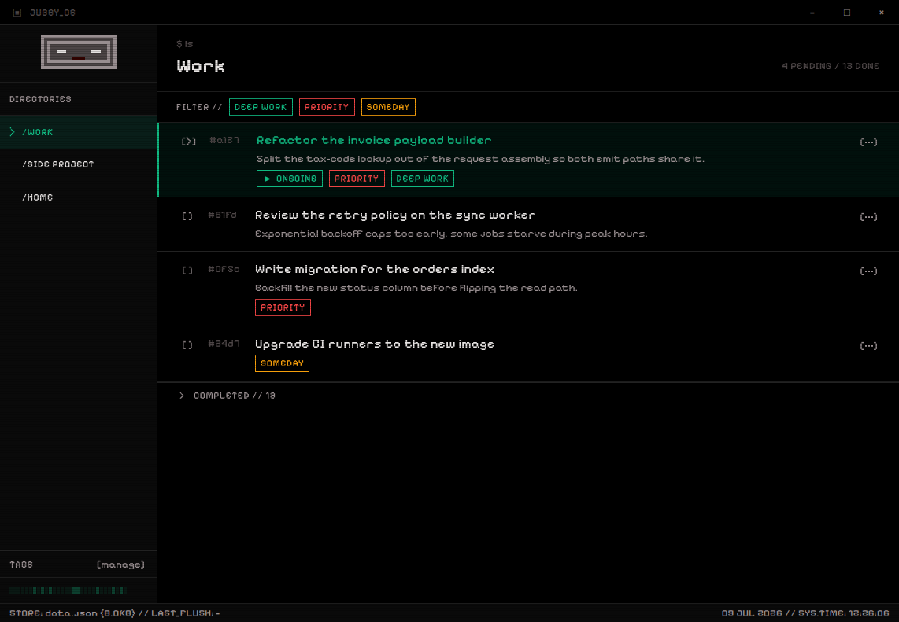

# jubby

A desktop task manager with a CRT terminal aesthetic. Fully local — data lives in Electron's `userData/store/`, no server, no login, no sync.



## Why

I wanted a task manager that opens instantly, works offline, and holds exactly my mental model of work — not a SaaS with boards, sprints, and an account. I use it daily as the single source of what I'm doing: work tasks, personal errands, and ideas for my own projects, each in its own folder. The core constraint is the **on-going task**: a global singleton for the one thing I'm working on right now. Starting another task demotes the previous one back to `todo`, so the app always answers "what am I doing?" with exactly one row pinned at the top.

The CRT look is not a skin over a normal app — power-on animation, scanline typography, a pixel-art AI companion in the sidebar that watches app events and reacts (Groq via Vercel AI SDK, key stored in the OS keychain via `safeStorage`), and a completion heatmap rendered as terminal blocks.

## Features

- **Folders** — every task lives in exactly one folder ("where it lives").
- **Tags** — first-class, cross-cutting labels across folders ("what it's like"), with color and filtering.
- **On-going task** — global singleton, pinned and highlighted; task state (`todo → on-going → done`) is derived from timestamps, not stored flags.
- **Grill viewer** — renders the markdown PRDs and decision logs from `grill/` inside the app.
- **AI entity** — a pixel cat that reacts to task events, idle time, and window focus with expressions and short messages.
- **Completion heatmap** — activity at a glance in the sidebar.
- **Auto-update** — `electron-updater` against GitHub Releases.

## Stack

Electron 33 + electron-vite, ORPC over MessagePort, React 19 with TanStack Router/Query, Tailwind v4, Arktype, JSON store (no native modules).

## Commands

```sh
bun install
bun run dev          # electron-vite (HMR)
bun run test         # vitest
bun run check        # lint + format
bun run dist         # build + AppImage/exe for the current platform
bun run dist:linux   # AppImage
bun run dist:win     # NSIS
```

## Release

```sh
npm version patch
git push --follow-tags
```

The tag triggers `.github/workflows/release.yml`, which builds Linux (AppImage) and Windows (NSIS) in parallel and publishes to GitHub Releases. Installed apps detect the release via `electron-updater`, download in the background, and apply on next quit. No code signing — the only update integrity is the SHA512 that `electron-builder` writes to `latest.yml`.

## Design decisions

- **JSON instead of SQLite.** Tried it, reverted. The costs (ABI dance per Electron version, postinstall hooks, prebuilds on every dev↔test switch, `bun test` blocked, drizzle-kit + migrations duplicating the schema's source of truth) paid for capacity a personal app never uses: joins, FTS, indexes over thousands of rows, multi-process concurrency. Today each domain is one file (`folders.json`, `tasks.json`, `settings.json`) with a `{ version, data }` envelope validated by arktype, atomic writes (`writeFile + rename`), and a serial queue per file. Migrations in TS, not SQL.
- **Derived task state.** No `done` or `status` field — `completedAt` → done, else `startedAt` → on-going, else todo. The timestamps the features already need (`startedAt` sorts the on-going task to the top, `completedAt` feeds the heatmap) double as the state, so there's no redundant field to keep in sync.
- **No code signing.** Windows shows a SmartScreen warning on first install. Accepted — personal app, no budget for a cert.
- **No macOS.** No hardware, no Developer ID. Shipping unsigned on macOS is worse than not shipping.

## Not supported

macOS, .deb, .rpm, MSI, arm64, code signing.
